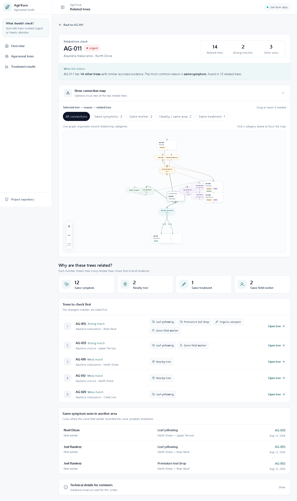
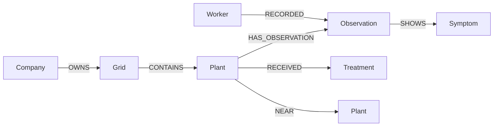

# AgriTrace

**AgriTrace is a graph-backed agarwood tree health investigation application built with Next.js and CognoDB.**

It focuses on agarwood plantations containing `Aquilaria malaccensis` and `Aquilaria crassna` trees. The application connects tree records with inspections, symptoms, treatments, field workers, growing areas, and farms so related health cases can be investigated as connected evidence rather than isolated records.

**Live demo:** https://agritrace-xi.vercel.app
**Repository:** https://github.com/DominceAseberos/AgriTrace

## What AgriTrace does

AgriTrace helps identify which agarwood trees may be related to one another and why.

A user can:

- review the overall health of the plantation
- browse and filter agarwood trees by species, growing area, and health status
- open a tree record and review inspections, symptoms, and treatment history
- see where a tree fits in the plantation hierarchy
- check related trees based on shared symptoms, nearby location, shared treatments, or shared field-worker observations
- inspect the connection map between a selected tree and the strongest related cases
- compare treatment outcomes across connected tree records

The central workflow is **Check Related Trees**.

## Screenshots

### Overview


### Agarwood trees


### Tree details


### Related trees


### Connection map



## Why a graph database?

The important questions in AgriTrace are about **connections between records**, not only the values stored on a single tree.

Examples include:

- Which other agarwood trees show the same symptom?
- Which nearby trees received the same treatment?
- Which cases are linked through more than one type of evidence?
- Did the same field worker record the same symptom in another growing area?
- Which treatment relationships resulted in improved, stable, or declined outcomes?

A relational database could represent the same entities, but these investigations would require several joins across tree, inspection, symptom, treatment, worker, and location tables.

CognoDB stores these connections as first-class relationships, allowing the application to follow the relevant paths directly with Cypher.

Relationship properties are also part of the model. For example:

- `RECEIVED` stores `appliedAt`, `dosage`, and `outcome`
- `NEAR` stores `distanceMeters`

## Graph data model



### Nodes

| Label | Represents |
| --- | --- |
| `Company` | Farm or plantation |
| `Grid` | Growing area |
| `Plant` | Agarwood tree |
| `Observation` | Field inspection |
| `Symptom` | Recorded health symptom |
| `Treatment` | Treatment or intervention |
| `Worker` | Field worker who recorded an inspection |

### Relationships

| Relationship | Meaning |
| --- | --- |
| `OWNS` | A farm owns a growing area |
| `CONTAINS` | A growing area contains an agarwood tree |
| `HAS_OBSERVATION` | A tree has an inspection record |
| `SHOWS` | An inspection shows a symptom |
| `RECORDED` | A worker recorded an inspection |
| `RECEIVED` | A tree received a treatment |
| `NEAR` | Two agarwood trees are spatially near each other |

## Main graph queries

All application queries use parameterized Cypher through the official Neo4j JavaScript driver.

### Multi-hop shared-symptom traversal

This traversal finds other trees connected to the selected tree through the same symptom.

```text
Plant
  → HAS_OBSERVATION
Observation
  → SHOWS
Symptom
  ← SHOWS
Observation
  ← HAS_OBSERVATION
Plant
```

```cypher
MATCH (source:Plant {id: $plantId})
  -[:HAS_OBSERVATION]->(:Observation)
  -[:SHOWS]->(symptom:Symptom)
  <-[:SHOWS]-(:Observation)
  <-[:HAS_OBSERVATION]-(other:Plant)
MATCH (company:Company)-[:OWNS]->(grid:Grid)-[:CONTAINS]->(other)
WHERE other.id <> source.id
RETURN
  other.id AS id,
  other.code AS code,
  other.species AS species,
  other.status AS status,
  grid.id AS gridId,
  grid.name AS gridName,
  company.name AS companyName,
  symptom.name AS symptomName
```

This is a four-relationship traversal between the selected tree and a related tree.

### Cross-area worker trace

This query finds cases where the same worker recorded the same symptom in another growing area.

```text
Source Grid
  → Plant
  → Observation
  ← Worker
  → Observation
  ← Plant
  ← Target Grid

Both observations → same Symptom
```

```cypher
MATCH (sourceGrid:Grid)-[:CONTAINS]->(source:Plant {id: $plantId})
MATCH (source)-[:HAS_OBSERVATION]->(sourceObs:Observation)<-[:RECORDED]-(worker:Worker)
MATCH (sourceObs)-[:SHOWS]->(symptom:Symptom)
MATCH (worker)-[:RECORDED]->(otherObs:Observation)<-[:HAS_OBSERVATION]-(other:Plant)<-[:CONTAINS]-(otherGrid:Grid)
MATCH (otherObs)-[:SHOWS]->(symptom)
WHERE other.id <> source.id AND otherGrid.id <> sourceGrid.id
RETURN DISTINCT
  worker.name AS workerName,
  symptom.name AS symptomName,
  sourceGrid.name AS sourceGrid,
  otherGrid.name AS targetGrid,
  other.id AS targetPlantId,
  other.code AS targetPlantCode,
  otherObs.observedAt AS observedAt
ORDER BY observedAt DESC
LIMIT $limit
```

### Shared treatment traversal

```cypher
MATCH (source:Plant {id: $plantId})-[:RECEIVED]->(t:Treatment)<-[:RECEIVED]-(other:Plant)
```

This identifies trees connected through the same treatment.

### Treatment outcome aggregation

```cypher
MATCH (t:Treatment)<-[r:RECEIVED]-(p:Plant)
RETURN
  t.id AS id,
  t.name AS name,
  count(DISTINCT p) AS cases,
  sum(CASE WHEN r.outcome = 'improved' THEN 1 ELSE 0 END) AS improved,
  sum(CASE WHEN r.outcome = 'stable' THEN 1 ELSE 0 END) AS stable,
  sum(CASE WHEN r.outcome = 'declined' THEN 1 ELSE 0 END) AS declined
```

This uses properties stored directly on the `RECEIVED` relationship.

## Related-case scoring

AgriTrace combines several kinds of graph evidence when ranking related trees:

- shared symptom: `3`
- direct `NEAR` relationship: `3`
- shared treatment: `2`
- cross-area worker trace: `4`

The combined score is grouped as:

- **Strong match:** score 7+
- **Possible match:** score 4–6
- **Weak match:** below 4

## Dataset

The current dataset contains:

- 2 companies
- 6 growing areas
- 72 agarwood trees across two Aquilaria species
- 8 field workers
- 8 symptoms
- 7 treatments
- inspection records for every tree
- additional follow-up inspections for trees needing attention
- 66 `NEAR` relationships between neighboring trees
- treatment relationships with dosage and outcome properties

The graph currently contains 198 outgoing relationships from agarwood tree nodes.

## Technology stack

- Next.js 16
- React 19
- TypeScript
- Tailwind CSS 4
- CognoDB Cloud
- Official `neo4j-driver`
- Cypher over Bolt/TLS
- `@xyflow/react`
- Zod
- Lucide React
- Vercel

## Project structure

```text
src/
  app/
    plants/              Agarwood tree records and details
    investigate/         Related-tree graph investigation
    insights/            Treatment relationship results
    page.tsx              Plantation overview
  components/
    investigation-graph.tsx
    tree-context-flow.tsx
    site-shell.tsx
    status-pill.tsx
  lib/cognodb/
    driver.ts
    queries.ts
    service.ts
    seed-data.ts
    types.ts
scripts/
  seed.ts
  health.ts
  smoke.ts
docs/screenshots/
```

## Current status

AgriTrace is live and connected to CognoDB.

- CognoDB connectivity verified
- graph seed loaded successfully
- multi-hop related-tree query verified
- cross-area worker trace verified
- production build deployed on Vercel
- live database health endpoint verified
